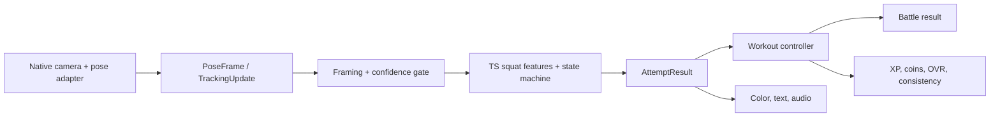

# NextRep implementation plan

**Product:** “Train your body. Level up your player.”

**Internal completion target:** Sunday, September 13, 2026, 8 a.m. Central.

This is the current plan for the four-person team. It consolidates the prior squat
trainer plan with the latest product decisions. It is a plan, not evidence that a
feature works. Current implementation status is recorded below.

## Current product and demo flow

NextRep is a React Native/Expo fitness game where players progress toward 99 OVR.
For the MVP, two users at one predefined real-world demo workout location check in,
challenge one another, agree on a squat workout, complete it, receive movement
feedback, and see a resolved battle plus saved progression.

Proposed demo sequence:

1. Both players check into the same predefined demo location.
2. One player starts a challenge; both see the same bodyweight-squat exercise,
   set count, reps per set, rest duration, and match time limit.
3. Each setting must be accepted by both players. Any change clears both previous
   acceptances. Once the battle starts, settings are locked.
4. Each player completes the configured workout. The phone processes pose data on
   device where feasible and emits completed attempts, rather than uploading raw
   camera frames or storing raw video by default.
5. The workout controller saves deduplicated completion and reward events. Battle
   resolution saves XP, coins, player progression, and eligible weekly consistency.
6. The player sees the battle result, weekly progress such as “2 / 3 workout days
   this week,” weekly streak, and last-workout date.

No room-code flow, inactivity penalty, or OVR reduction belongs in active scope.

## Accepted MVP scope

### Battle and workout

- One predefined demo workout location and two checked-in users; no location
  discovery, venue map, or room codes.
- One exercise: bodyweight squats.
- Shared, mutually accepted exercise, sets, reps per set, rest duration, and match
  time limit. A settings update clears acceptance; battle start locks settings.
- Native camera preview and on-device pose inference through a React Native adapter
  in an Expo development build. Expo Go is not a supported path for this native
  dependency stack.
- A rep is counted once only after a complete observed attempt. Rep counting and
  movement-quality assessment remain separate decisions.
- Movement feedback is evaluated across an attempt, never from an isolated frame:

  | State | Meaning | Count |
  | --- | --- | --- |
  | Green | Complete rep reached the preferred defined movement target | +1 |
  | Yellow | Complete rep reached the minimum defined target | +1 |
  | Red | Assessable partial attempt remained below the minimum target | +0 |
  | Neutral | Tracking/framing cannot assess the attempt; pause and allow retry | +0 |

- Pair every color with concise text and an audio cue. Ratings describe explicit
  gameplay movement targets; they do not claim medically validated posture advice.
- Tracking confidence and framing checks are explicit. A tracking interruption
  invalidates the in-progress attempt and preserves all completed totals.
- Resolve battles and persist workout completion, XP, coins, and player progression.
  Deduplicate workout completion and reward events so retries or callbacks cannot
  grant rewards twice.

### Progression and consistency

- Earned OVR is permanent. Rest days and inactivity never subtract earned OVR.
- XP advances long-term progression. Coins purchase in-game rewards. Battle points
  determine only an individual match.
- A player chooses a target number of workout days per week. Count at most one
  qualifying day per calendar date.
- A completed configured workout qualifies regardless of battle outcome. Abandoned
  or partial workouts do not. A solo completed workout may qualify when solo mode
  is introduced or otherwise configured.
- Show current weekly progress, weekly streak, and last-workout date. Persist each
  across reloads.

## Proposed defaults and unresolved decisions

### Calendar and consistency defaults

These defaults are proposed for the MVP and must be encoded consistently before
the consistency UI ships:

- Weeks are Monday–Sunday in a stored user timezone.
- Store completion times as UTC timestamps and attribute their qualifying local
  calendar date using that stored timezone.
- A weekly-target change starts next week; it must not alter an already-open or
  closed week retroactively.
- Mark a successful week once only. Increment its streak once only.
- Reset a streak only when an unsuccessful week closes, never during its active
  week. Reconcile every elapsed week when the app next opens.
- Derive progress from saved, deduplicated completed-workout events so reloads,
  repeated callbacks, or multiple workouts on one local date cannot inflate it.

### Battle scoring — proposed, not accepted

The current recommendation is 100 points per completed rep, plus 10 points for
each green rep. Yellow completed reps receive base points; red/neutral attempts
receive zero. Cap awarded points at the agreed workout targets. Enable quality
bonuses only after consistent cross-device testing; until then, completion-only
scoring with draws is the fallback.

**Unresolved:** removing OVR from battle scoring was recommended but has not been
explicitly approved. Keep battle points and permanent earned OVR separate in data
and UI until the team decides whether OVR affects a match.

### Activity bonus — accepted future direction, not MVP

Future progression may expose a separately identified, recoverable activity bonus
of up to +5 OVR. Displayed OVR remains capped at 99; earned OVR never declines.
The proposed decay starts after 14 inactive days and removes one bonus point per
further inactive week. Future qualifying workouts restore the bonus.

Exact earning, restoration, and planned-break rules remain unresolved. Do not
implement decay, scheduled jobs, planned-break mode, or an inactivity penalty for
this MVP.

## Architecture and ownership

Keep native camera/inference, pure movement analysis, game control, and presentation
separate. Native code supplies frames/landmarks and health signals; TypeScript turns
valid landmark sequences into attempt events; the controller owns the persisted
game effects. Continuous tracking updates must never itself award reps or rewards.

| Owner | Primary responsibility | Boundary and risk |
| --- | --- | --- |
| CV | Landmark features, temporal rep state machine, rating rubric, replay tests | Pure TypeScript; must not invent confidence or attach rewards to frames. |
| Native | Camera, MediaPipe adapter, model packaging, lifecycle, iOS/Android builds | Highest early integration risk; must establish landmarks on both phones. |
| Workout UI | Setup, guidance, counter, color/text/audio feedback, weekly consistency UI | Depends on stable event contracts; do not present simulation as CV output. |
| Game integration | Location/check-in, shared battle state, resolution, rewards, persistence | Largest feature surface after native integration; needs idempotent writes and conflict rules. |

The native and game-integration roles are materially larger than the UI role once
the basic screens exist. The team should rebalance after the camera spike: UI can
own consistency presentation and integration tests; CV can help define/replay the
scoring event stream; native work should not become a single-person bottleneck.

### Module boundaries

| Area | Current / planned module responsibility |
| --- | --- |
| `src/features/tracking` | Camera permission/preview, pose adapter lifecycle, model, frame normalization, tracking guidance. |
| `src/contracts` | Timestamped pose frames, tracking updates, and completed-attempt contracts shared across owners. |
| `src/features/squat` | Pure landmark features, smoothing, confidence/framing gate, temporal squat state machine, and rating rubric. |
| `src/features/workout` | Active set/rest/match timing, idempotent attempt consumption, completion event, feedback orchestration. |
| `src/features/progression` | Player state, XP, coins, earned OVR, weekly qualification/streak and durable deduplication. |
| Planned battle/location feature | Check-in state, shared settings/acceptance, locked battle config, participant progress, resolution. |

## Data and events

All externally observable game effects need stable IDs and idempotent handling.
Prefer append-only domain events or an equivalent atomic local record over mutating
several unrelated records after each rep.

| Record/event | Essential fields and rules |
| --- | --- |
| `PoseFrame` | Capture timestamp and unit, image width/height, coordinate space, normalized landmarks, supplied visibility/presence/confidence only. Native adapter normalizes orientation/mirroring and rejects stale results. |
| `TrackingUpdate` | Status, observed time, confidence/framing failure reason, guidance. It is continuous health information, not an attempt or reward. |
| `AttemptResult` | Session, set, attempt IDs; started/ended time; assessable/completed; `countDelta`; green/yellow/red/null rating; reason; rubric version. Emit after observed completion, once. Add measured feature summary only when the rubric requires it. |
| `WorkoutConfig` | Exercise, set count, reps per set, rest duration, match time limit, config version. Both battle participants accept the identical immutable version. |
| `Battle` | Battle/location IDs, two participant IDs, config version, each acceptance/version, lifecycle, start/end time, score policy version, resolved result. Any config mutation clears acceptance; start locks it. |
| `WorkoutCompletion` | Completion ID, workout/battle/player IDs, completed UTC time, local-date attribution timezone/date, config version, qualifying status, source and idempotency key. Only completed configured workouts qualify. |
| `RewardGrant` | Grant ID/idempotency key, source completion/battle ID, XP, coins, earned-OVR change, battle points, created time. Apply at most once. |
| `WeeklyTarget` | Target, effective week start, stored timezone, revision. Target changes apply from its next-week effective boundary. |
| `WeeklyWeekResult` | User, week start/timezone, target revision, distinct qualifying local dates, success finalized once, streak outcome. Persisted reconciliation must be repeatable. |

For a battle, preserve raw `AttemptResult` identities or their derived capped totals
until resolution completes. Score calculation reads only deduplicated completed
attempts that belong to the locked config and occur before the match deadline.

## Tracking and algorithm foundation

LearnOpenCV’s squat trainer is an algorithm reference, not reusable React Native
application code. Its Python/Streamlit program will not run inside React Native.
Use native MediaPipe Pose Landmarker inference to produce landmarks and implement
features, state, and rating logic independently in TypeScript. Verify the applicable
license before copying any upstream source, threshold, video, or asset. No source
from that repository has been copied into this project.

Relevant technical foundation from the earlier plan:

- Use a fixed supported setup with full-body framing and selected side view.
- Convert normalized landmarks to a documented coordinate system before geometry.
  Name each feature/angle, its units, and its direction.
- Calibrate a standing baseline, smooth data by time rather than frame count, and
  require persistence to avoid frame-rate-specific behavior.
- Proposed rep sequence: `READY → DESCENDING → MINIMUM_RANGE_REACHED → ASCENDING
  → READY`. Count only after stable return to standing if the attempt reached the
  minimum target. Track peak range over the entire attempt.
- Small standing movement does not start an attempt. A meaningful descent that
  returns below minimum is red. Holds/bottom bounces remain one attempt. Missing,
  occluded, unsupported, or unreliable tracking is neutral and requires a fresh
  stable start.
- Begin with one calibrated range-of-motion dimension. Keep movement-start,
  minimum, and preferred thresholds configurable/versioned; do not transfer
  LearnOpenCV numeric thresholds without mapping their feature definition.
- Keep raw frames transient and on device where feasible. Do not add a Python
  backend, frame upload, or raw-video storage by default.

The existing native-integration decision and its library-specific compatibility
gaps remain in [native-integration.md](native-integration.md).

## Ordered implementation milestones

1. **Lock contracts and event IDs.** Align `PoseFrame`, `TrackingUpdate`,
   `AttemptResult`, workout config, workout completion, rewards, weekly result,
   and battle state. Establish IDs and deduplication rules before parallel work.
2. **Prove camera → landmarks on real phones.** Build the development client and
   wire one model through the native adapter on one named iPhone and Android phone.
   Verify permissions, orientation, mirroring, timestamps, lifecycle and visible
   landmarks. Resolve the existing native build blockers first.
3. **Build pure squat analysis.** Implement confidence/framing gate, calibration,
   temporal rep lifecycle, and versioned range rubric. Replay timestamped landmark
   fixtures at several frame rates; emit only completed attempt events.
4. **Integrate workout loop.** Connect real attempt events to configured sets,
   rest, match deadline, feedback, and completion. Preserve totals across tracking
   loss and block duplicate event effects.
5. **Implement persistence and consistency.** Save completed workouts, rewards,
   player values, weekly target/date attribution/streak, and reload reconciliation.
6. **Implement demo location and battle.** Support two check-ins, shared config,
   cleared acceptance after edits, locked start, individual capped score totals,
   resolution, and both players’ completion credit.
7. **Freeze scoring and rehearse.** Decide whether quality bonuses are enabled and
   resolve OVR’s battle role. Test on phones, simplify unreliable paths, run the
   end-to-end demo without simulated CV output.

## Acceptance tests

### Physical device and inference

- Camera permission allow, deny, Settings recovery, front/back selection,
  background/resume, navigation cleanup, and no microphone permission on one iPhone
  and one Android device.
- Each phone shows aligned landmarks for full-body, supported side-view squats.
  Record phone model, OS, app build, model asset/version/hash, environment,
  analyzed frame rate, latency, and failures.
- Test full body out of frame, occlusion, multiple people, poor confidence,
  orientation changes, camera switch, interruption and resume. Each must provide
  neutral guidance without a red rating or fabricated count.
- Validate timestamp ordering and stale-result rejection on both platforms. Do not
  substitute inference duration or callback arrival time for capture time.

### Rep/rating/scoring

- Compare manual and detected counts for at least three participants, two five-rep
  sets each, on each required device. Record all discrepancies.
- Confirm full reps count exactly once; partials, bounces, standing movement,
  repeated native callbacks and tracking interruption add no extra rep. Completed
  totals remain after interruptions.
- Freeze a non-medical gameplay rubric and manually label separate evaluation
  attempts. Report agreement as rubric agreement, not medical accuracy. Pair every
  final state with text/audio.
- Use only actual scored attempts for battle points. Confirm green bonus, yellow
  base, cap at agreed target, fallback draw, duplicate retry, and resolution do not
  grant duplicate rewards. Do not enable quality bonuses unless cross-device tests
  are consistent.

### Battle, persistence, and calendar

- Two users at the demo location must accept the same config. Editing one field
  clears both acceptances; start locks settings; only two participants can join.
- A qualifying completed workout creates exactly one completion, reward set, and
  local qualifying date across reload/retry. Abandoned/partial workouts create none.
- Two qualifying workouts on one local date count as one day. Completion close to
  UTC midnight receives the stored-timezone local date consistently.
- Target change is effective next week. Successful weeks increment once; an active
  week never resets a streak; elapsed missed weeks reset only when reconciled after
  closure. Rest days never affect earned OVR.

## Deferred features

- Multiple exercise-tracking models and automatic exercise recognition.
- Large venue maps, discovery systems, and locations beyond the demo venue.
- Team battles and location-specific power-ups.
- Complex shops and activity-bonus decay/scheduled jobs/planned-break mode.
- Custom ML training, cloud raw-video storage, camera-frame uploads, and a Python
  inference backend.

## Implemented versus planned

| Area | Actual repository status on September 12, 2026 |
| --- | --- |
| App shell | Implemented: Expo/TypeScript app with local home, workout setup, and progression screens. |
| Camera | Implemented but untested on phones: permission flow, VisionCamera preview, front/back switch, app lifecycle handling. |
| Native pose | Planned: a `react-native-mediapipe` candidate is installed/autolinked, but the exported adapter explicitly reports “Pose tracking not connected”; no model or landmark output is wired. |
| Squat logic | Planned: pure `SquatEngine` interface only. No feature computation, tracking gate, state machine, count, rating, or fixture tests. |
| Feedback | Planned: setup text exposes the green/yellow/red/neutral model only through documentation/contracts; no live result display or audio is implemented. |
| Workout/game control | Partial foundation: five-rep display target and in-memory attempt dedup reducer exist. Sets, rest, match limits, completion, battle scoring, XP and coins are not implemented. |
| Progression | Partial foundation: initial local player state stores XP, level and processed attempt keys. Earned OVR, coins, rewards, upgrades, durable event processing, weekly target/streak, and last-workout data are not implemented. |
| Location/battle | Planned: no check-in, shared state, participant data, acceptance, settings lock, or resolution exists. |
| Validation | Typecheck, lint, JS bundle and pod install previously passed. Native iOS compile is blocked by the documented Xcode 26.6/RN `fmt` issue; Android native compile is blocked because this host lacks a Java runtime. No phone or inference test has been performed. |

See [validation.md](validation.md) for exact prior commands and blockers. Do not
represent anything in the planned rows as a demonstrated demo capability.
